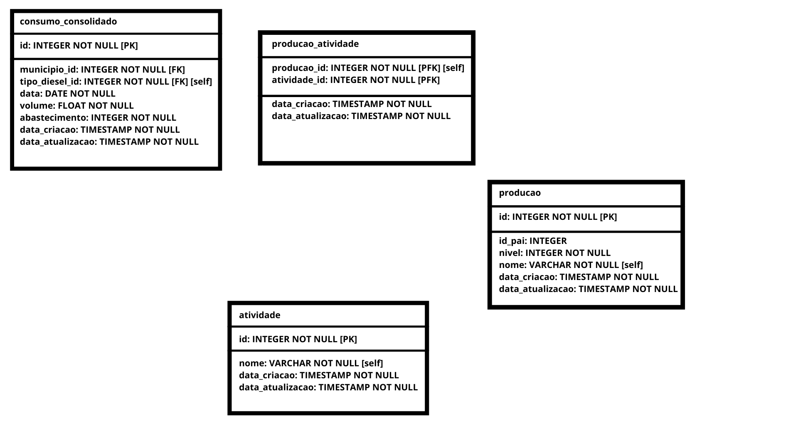
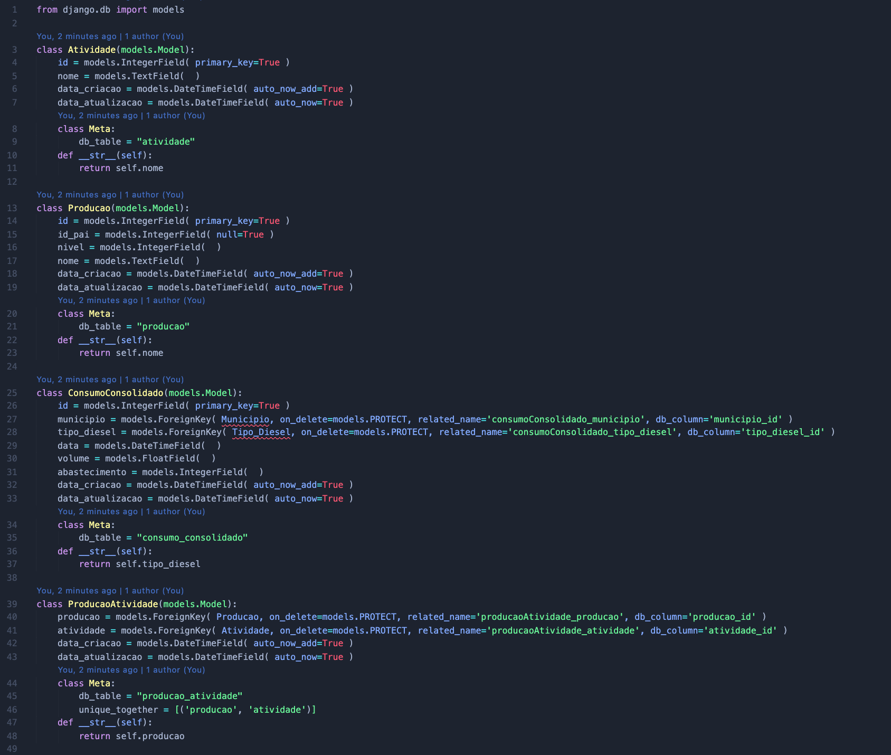
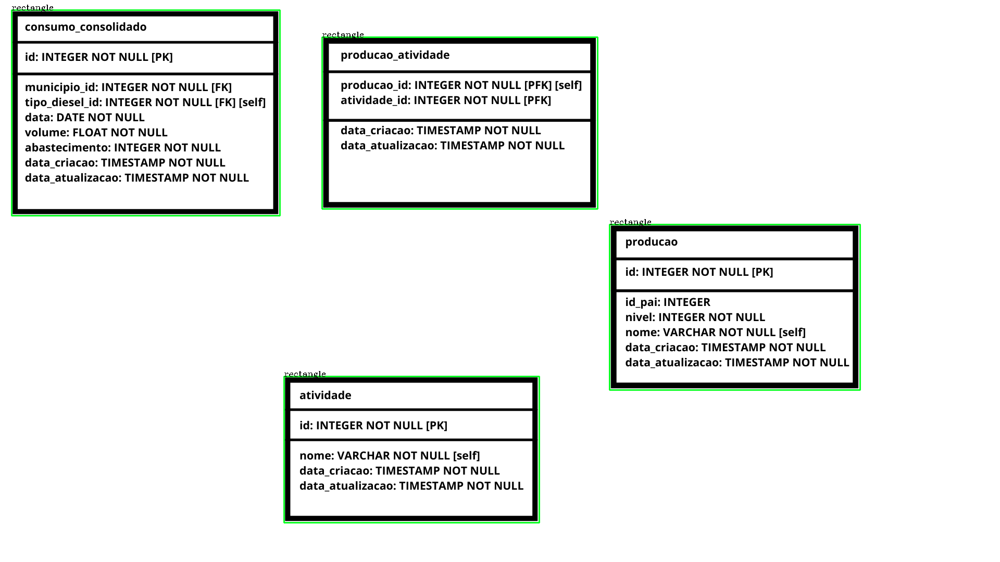
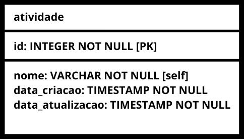
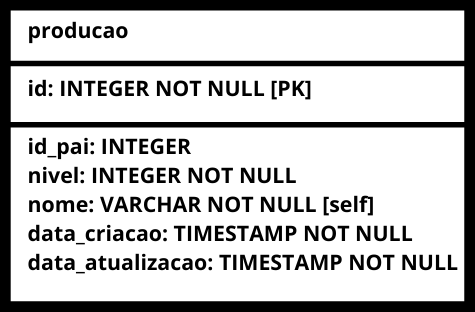
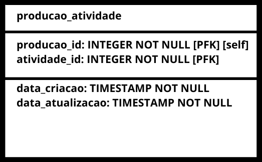
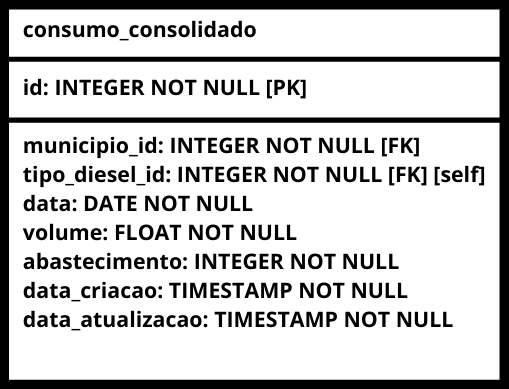
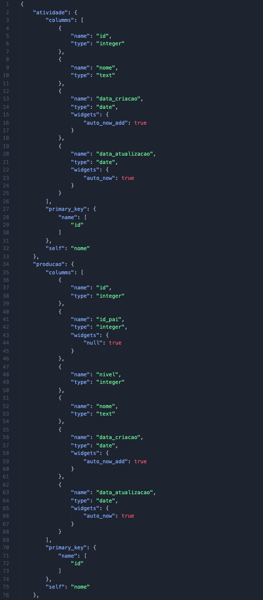
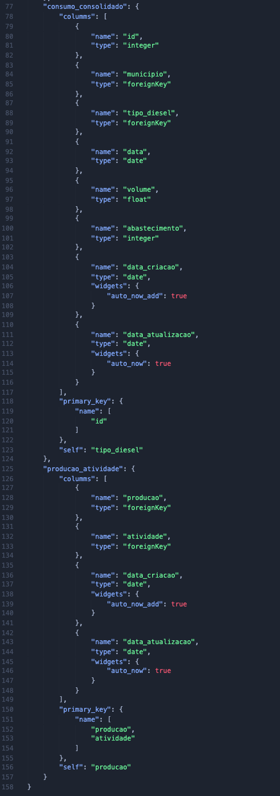

# gera_orm_django

Este projeto foi feito para otmização e abstração do uso da linguagem python no servidor django a partir do modelo de dados.

Dessa forma conseguimos criar o ORM para o framework django através de uma imagem do modelo de dados do sistema, como exemplificado a baixo.

<h1>Instalação:</h1>

- Abra o terminal: 
     pip install virtualenv
- Crie o ambiente virtual: 
     virtualenv nome_da_pasta
- Entre na pasta da virtualenv: 
     cd ./nome_da_pasta
- Crie a pasta do projeto:
     mkdir pasta_projeto
- Entre na pasta do projeto:
     cd ./pasta_projeto
- Clone o projeto:
     git clone https://github.com/romulorizo/gera_orm_django.git
- Instalando dependências:
     pip install requirements.txt

<h1>Uso do programa</h1>

Para rodar o programa, deve ser feito um desenho do modelo de dados e colocar ele na pasta principal do projeto:

    modelo_dados.png

Em seguida, compilar o arquivo criar_modelos.py , para criar o código do ORM:

    models.py

<h1>Funcionamento</h1>

- O projeto usa a biblioteca Opencv para identificar na imagem os retangulos onde estão escritos os modelos de dados.

- Cria imagens separadas para cada uma das tabelas.

- Utiliza a bibliotéca pytesseract que faz o OCR dos textos das imagens , e a biblioteca PIL manipulação das imagens.
- Estrutura os dados em um json.

- Trata o json e cria o código do ORM.

    models.py

