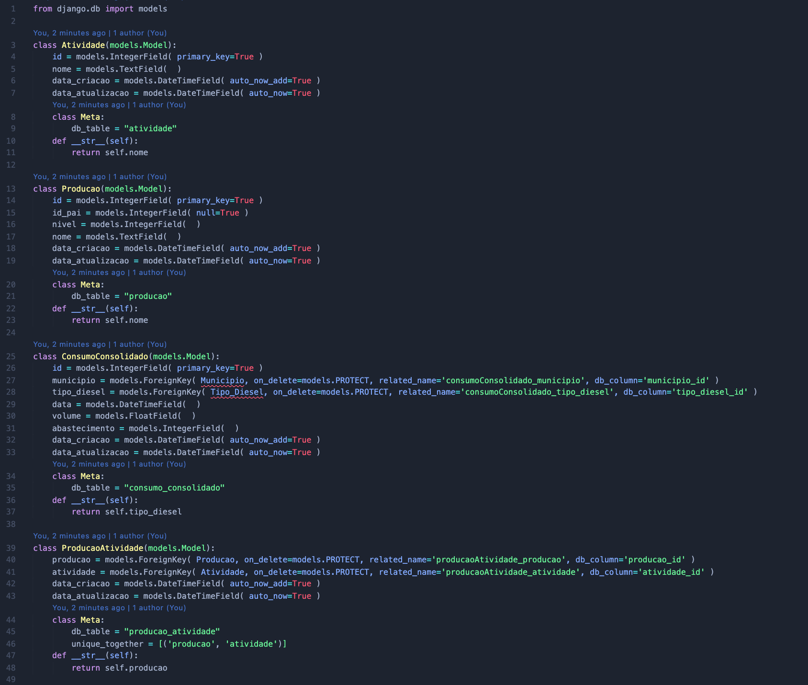
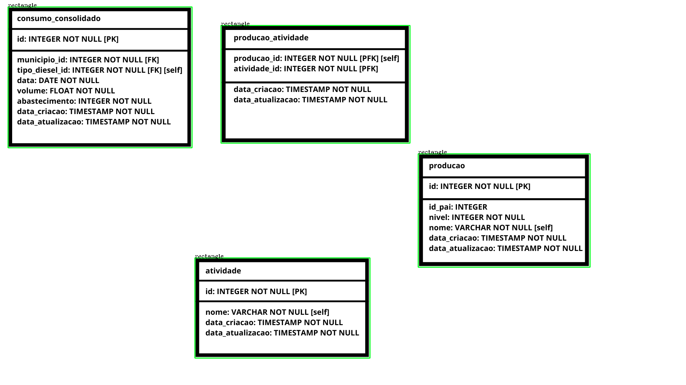
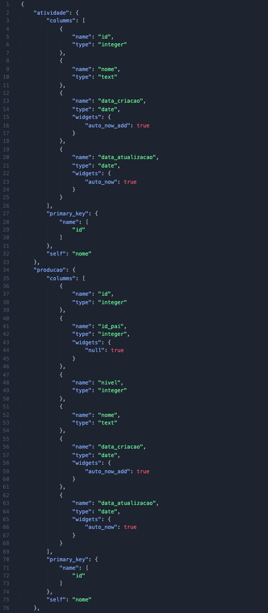
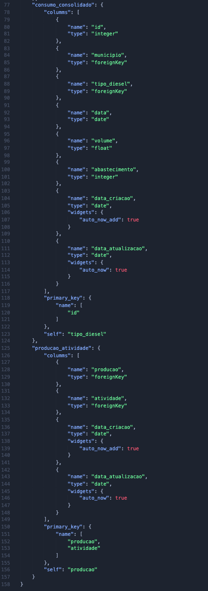

<h1 align="center"> Gera ORM Django </h1>

Este projeto foi feito para otimização e abstração do uso da linguagem de programação <a href="https://www.python.org/">Python</a> no servidor <a href="https://www.djangoproject.com/">Django</a> a partir imagens do modelo de dados.

Dessa forma conseguimos criar o ORM (Object Relational Mapper) para o framework <a href="https://www.djangoproject.com/">Django</a> através de uma imagem do modelo de dados do sistema, como exemplificado a baixo.

## :rocket: Instalação ##

- Abra o terminal: 
<br>    ``` $ pip install virtualenv ```

- Crie o ambiente virtual: 
<br>    ``` $ virtualenv nome_da_pasta ```

- Entre na pasta da virtualenv: 
<br>    ``` $ cd ./nome_da_pasta ```

- Crie a pasta do projeto:
<br>    ``` $ mkdir pasta_projeto ```

- Entre na pasta do projeto:
<br>    ``` $ cd ./pasta_projeto ```

- Clone o projeto:
<br>    ``` $ git clone https://github.com/romulorizo/gera_orm_django.git ```

- Instalando dependências:
<br>    ``` $ pip install requirements.txt ```

## :checkered_flag: Uso do programa ##

Para rodar o programa, você deve ser fazer uma imagem do modelo de dados, como a do exemplo abaixo, e colocá-la dentro da pasta principal do projeto:


Em seguida, compilar o arquivo criar_modelos.py, para criar o código do ORM que será gerado dentro de uma pasta nomeada "resultado":


    
## :facepunch: Funcionamento ##

- O projeto usa a biblioteca <a href="https://opencv.org/">OpenCV</a> para identificar na imagem os retângulos onde estão escritos os modelos de dados:



- Cria imagens separadas para cada uma das tabelas dentro de uma pasta chamada "imagens_tabelas":


- Utiliza a biblioteca <a href="https://pypi.org/project/pytesseract/">pytesseract</a>, que faz o OCR (Optical Character Recognition) dos textos das imagens, e a biblioteca PIL, que faz a manipulação das imagens.

- Cria uma estrutura os dados em um json, dentro da pasta resultado:




- Trata o json e cria o código do ORM dentro da pasta resultado:


Qualquer coisa, entre em contato comigo, <a href="https://www.linkedin.com/in/romulo-rizo-cabral/">Rômulo Rizo.</a>
